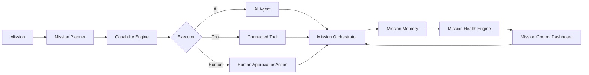
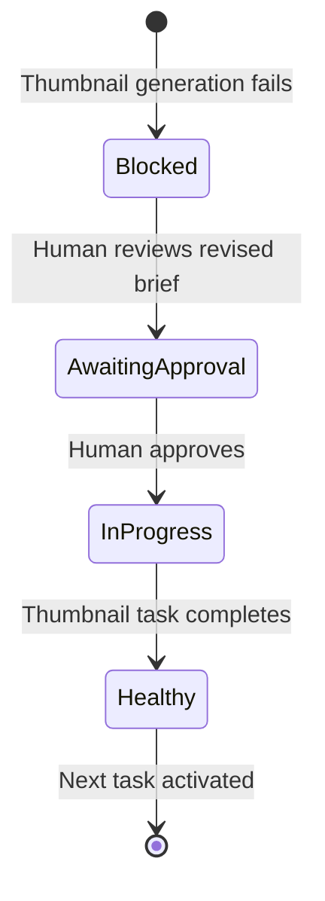

# Architecture

## System components

### 1. Mission Planner

Converts a mission into stages, tasks, dependencies, completion criteria, and required artifacts.

### 2. Capability Engine

Evaluates each task and selects an AI agent, connected tool, or human as the executor. Its routing decision considers capability, permissions, risk, confidence, and whether judgment or approval is required.

### 3. Mission Orchestrator

Controls task state, dependencies, retries, pauses, approvals, and continuation. It prevents blocked or unapproved work from advancing.

### 4. Mission Memory

Stores mission context, artifacts, decisions, blockers, approvals, and execution history so the mission can continue without being reconstructed from chat history.

### 5. Mission Health Engine

Calculates status, confidence, risk, blockers, momentum, and the recommended next action. The demo uses deterministic, source-controlled rules from the mission record so every health change is explainable and testable.

### 6. Mission Control Dashboard

Makes mission state understandable and actionable. It foregrounds health, current stage, blockers, next action, human input, executor ownership, routing reasons, and recent decisions.

## System flow

## Core data model

- **Mission:** identity, objective, success criteria, current stage, health, confidence, progress, and timestamps.
- **Task:** stage, state, dependencies, executor, routing reason, completion criteria, progress weight, and next action.
- **Executor:** `ai`, `tool`, or `human`, plus the named capability responsible for the work.
- **Blocker:** severity, affected task, cause, owner, and resolution action.
- **Decision:** actor, choice, rationale, timestamp, and downstream effect.
- **Artifact:** type, location, producing task, review state, and version.
- **Activity:** timestamped state transition or event suitable for the mission log.

## Demo state transition

## Implemented MVP boundary

The dashboard consumes `data/demo-mission.json` as its contract. `app/mission-engine.js` validates that contract, calculates weighted progress and confidence, applies declared transitions, and produces activity and decision records. Compatible state is saved in browser storage and invalidated when the source revision changes.

External agents, image generation, publishing, and server-side durable storage remain deferred until the complete handoff-and-continuation loop is demonstrable.

