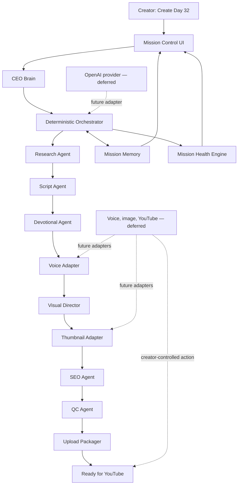

# Architecture Diagram

## Boundary

The deterministic orchestrator owns state, routing, dependencies, artifacts, and completion. Provider adapters execute specialized work later. The UI only renders validated engine state. External publishing never occurs inside the current demo.

